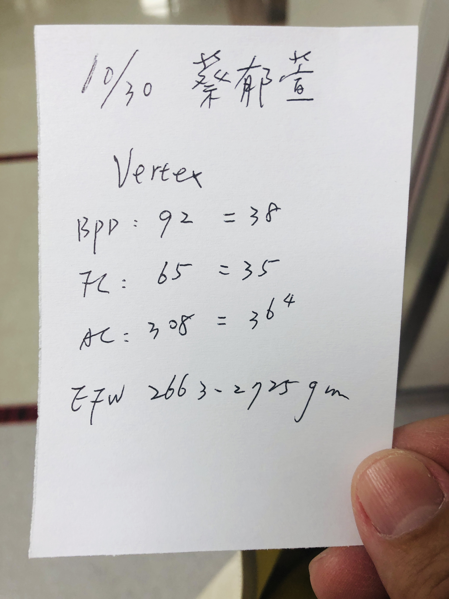
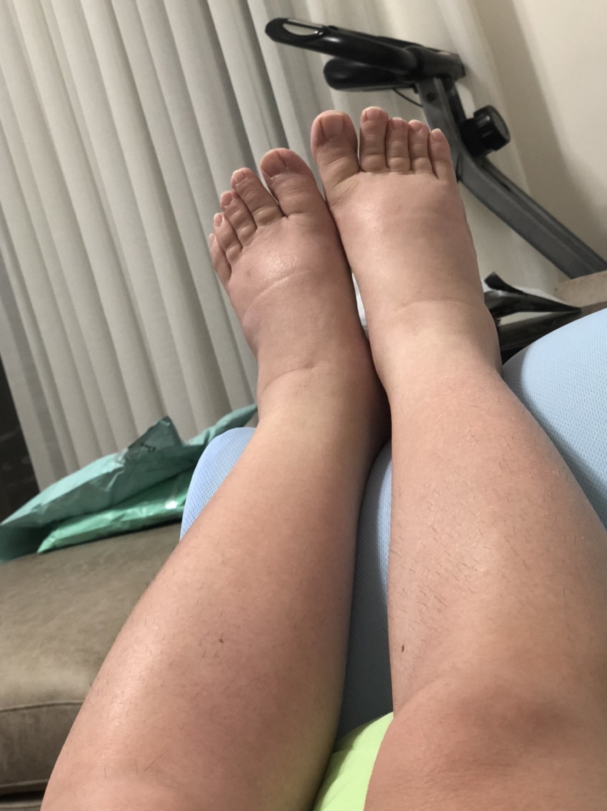

## 內容

* 地點：台北國泰醫院
* 週數：35W+2D
* 體重：64.1 kg  
* 血壓：115/71 mmHg
* EFW(預估寶寶的總體重)：2663~2725 g
* BPD(胎兒頭骨直徑)：92 = 38W
* AC(胎兒腹圍)：308 = 36W+4D
* FL(胎兒大腿骨的長度)：65 = 35W

> 醫生：胎兒有點大，要開始多運動，減少水果、含糖飲料、醣類食物  
> 醫生：胎兒大，媽媽肚子的空間有限，所以才會覺得肚子緊緊的  
> 醫生：水腫要到生產後才會開始消腫  

## 圖片

   

## 影片

