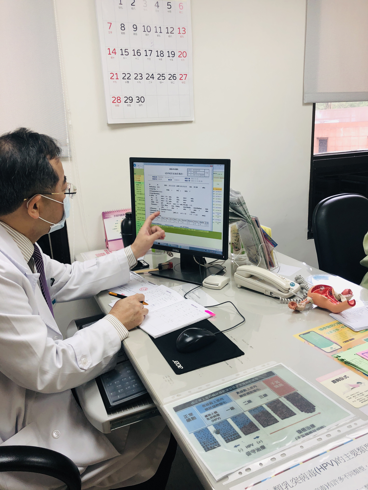
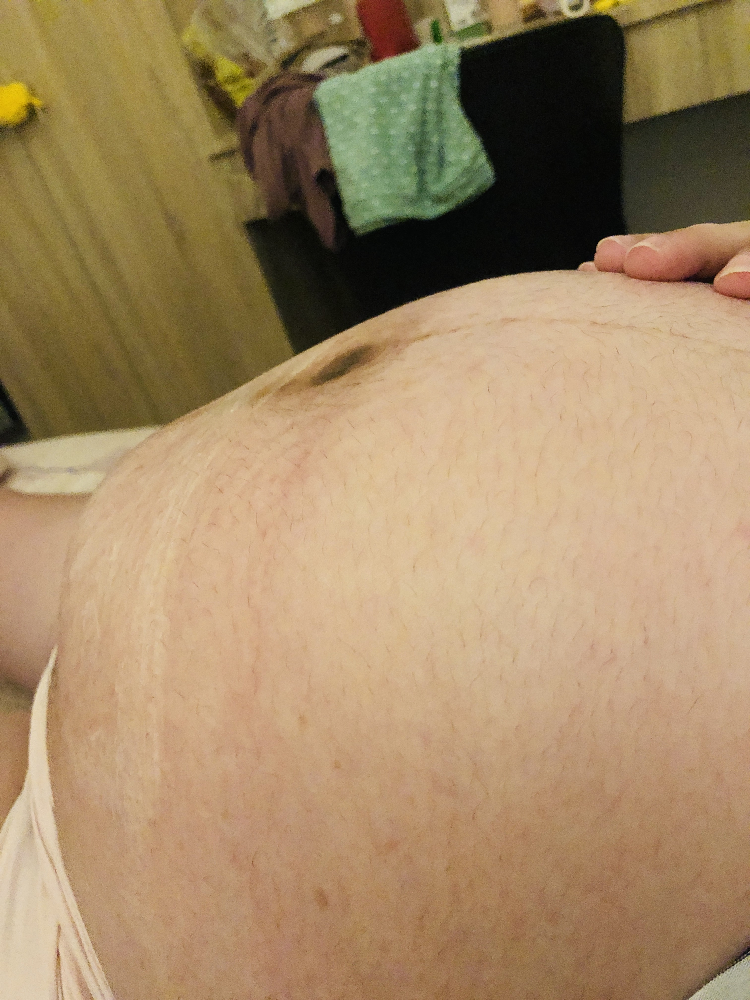

## 內容

* 地點：台北國泰醫院
* 週數：37W+2D
* 體重：64.5 kg  
* 血壓：115/73 mmHg
* EFW(預估寶寶的總體重)：2963 g
* BPD(胎兒頭骨直徑)：94mm = 40+W
* AC(胎兒腹圍)：326mm = 38W+4D
* FL(胎兒大腿骨的長度)：69mm = 40W
* HC(胎兒頭圍)：329mm = 41+W

> 醫生：體重維持的不錯  
> 醫生：肌瘤 47*30mm，變小了

## 圖片

    
    

## 影片






