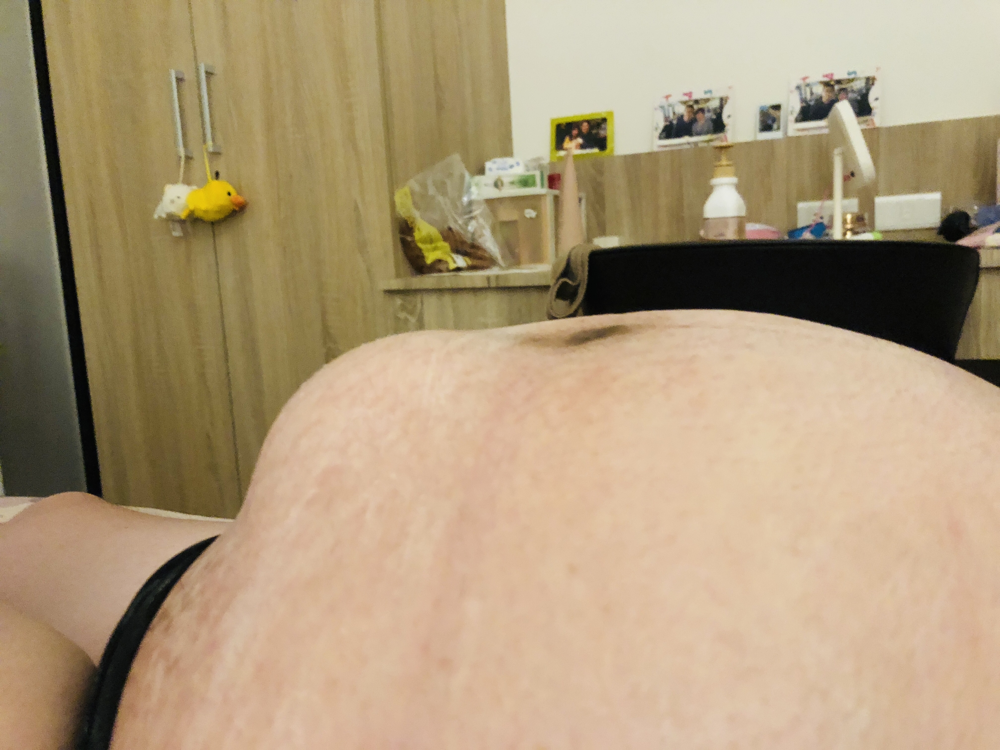
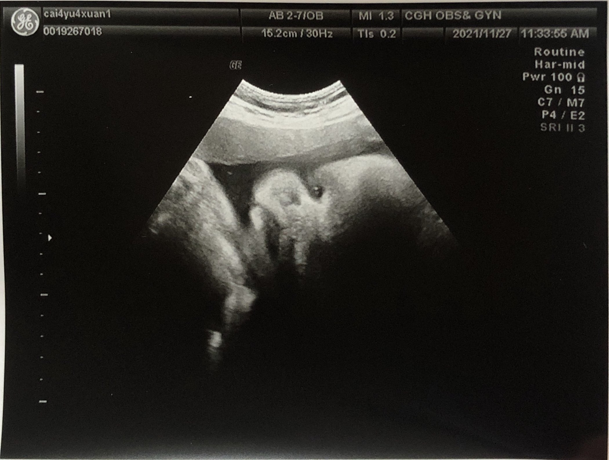
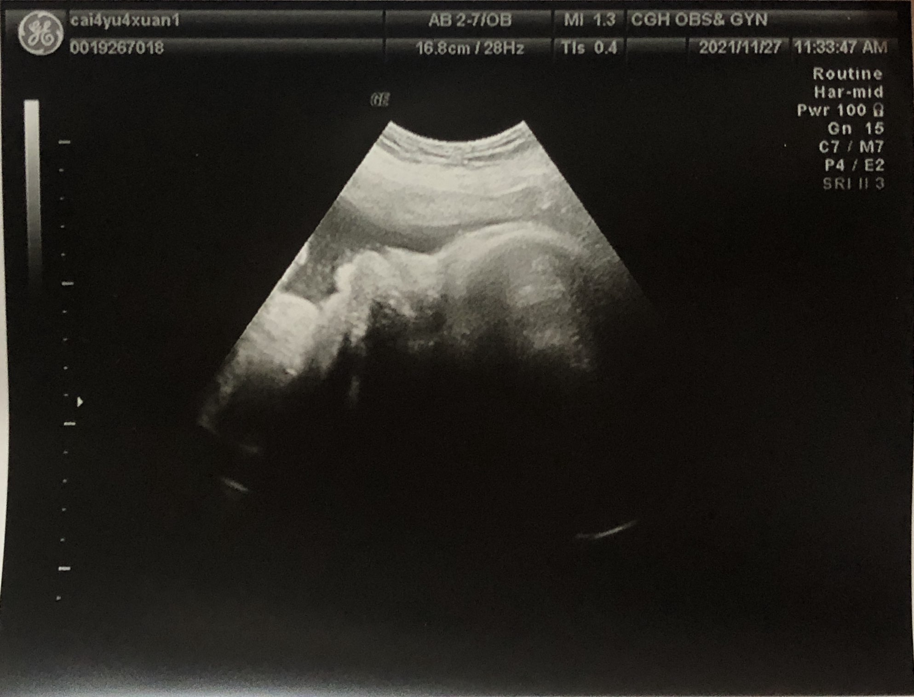
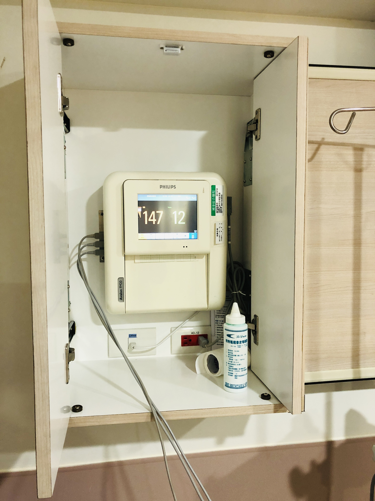
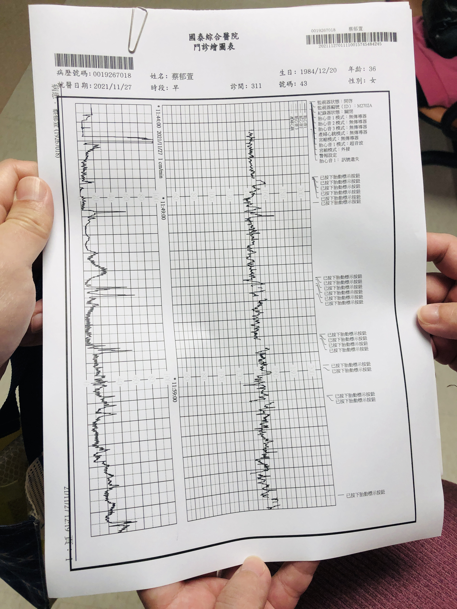
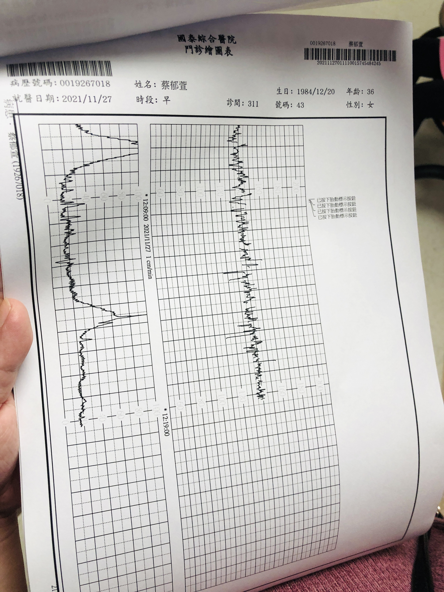
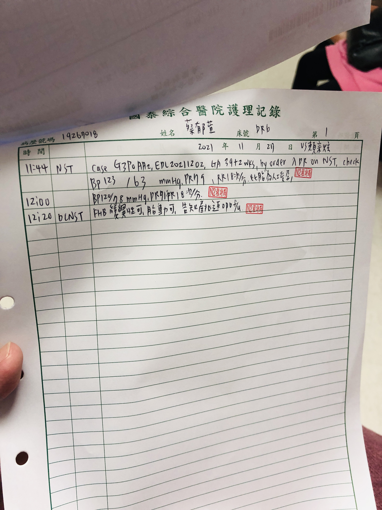
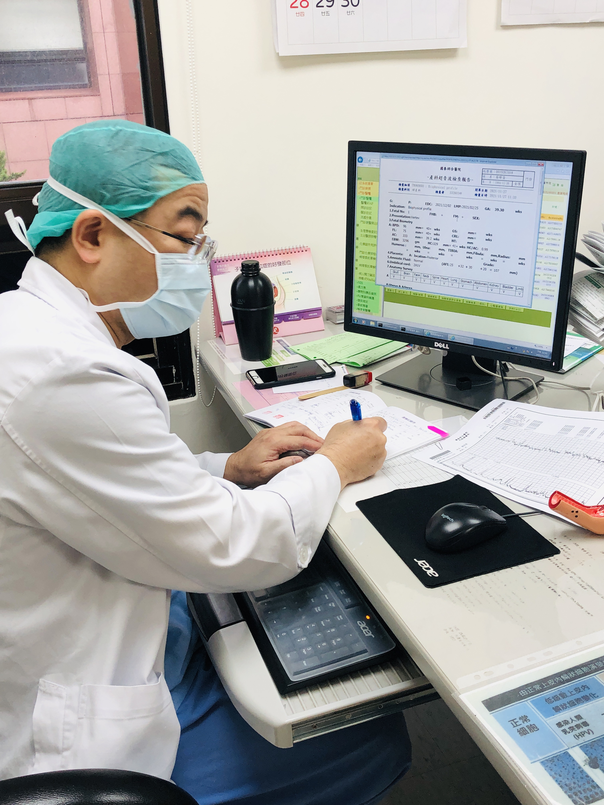

## 內容

* 地點：台北國泰醫院
* 週數：39W+2D
* 體重：64.2 kg  
* 血壓：118/78 mmHg
* EBW(預估寶寶的總體重)：3296 g
* BPD(胎兒頭骨直徑)：96mm = 40+W
* AC(胎兒腹圍)：333mm = 39W+2D
* FL(胎兒大腿骨的長度)：75mm = 40+W
* HC(胎兒頭圍)：329mm = 41+W

> 醫生：體重要控制，要少吃澱粉、糖，寶寶體重不要3500g，不然會不好生  

## 圖片

    
    
      
      

## 影片








